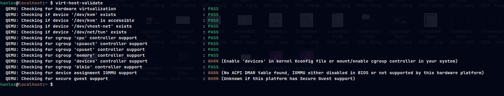

# Laboratorio de KVM practico

1. Instalacion de KVM

```sh
sudo dnf install qemu-kvm libvirt virt-install
# verificar que esta corriendo el sistema
sudo systemctl start libvirtd
sudo systemctl enable libvirtd
sudo systemctl status libvirtd
```

2. Validar requisitos del host

```sh
virt-host-validate
```



3. Configuracion del servidor VNC de qemu
4. Transferir la imagen ISO de Centos
5. Creación de una mauina virtual (virt-install)
6. Instalacion de alpine
7. Componenetes de una maquina virtual en KVM
8. Tipos de redes de KVM
9. Crear una interfaz en modo puente
10. Agregar una nueva red en KVM
11.
